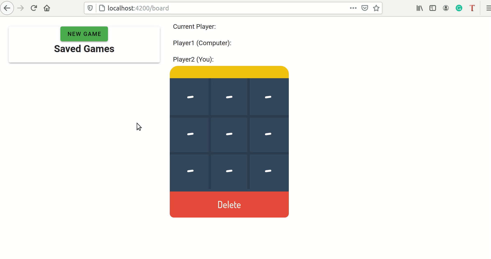

## Tictactoe

This game is a challenge to make tictactoe game using django and vuejs.


It is composed of two separate Docker containers that holds:

- Django backend (tictactoe-backend)
- VueJs frontend (tictactoe-frontend)

The entry point for a user is a website which is available under the address: **http://localhost:4200/**




---

### Prerequisites

In order to run this application you need to install two tools: **Docker** & **Docker Compose**.

Instructions how to install **Docker** on [Ubuntu](https://docs.docker.com/install/linux/docker-ce/ubuntu/), [Windows](https://docs.docker.com/docker-for-windows/install/), [Mac](https://docs.docker.com/docker-for-mac/install/).

**Docker Compose** is already included in installation packs for *Windows* and *Mac*, so only Ubuntu users needs to follow [this instructions](https://docs.docker.com/compose/install/).


### How to run it?

The entire application can be run with a single command on a terminal:

```
$ sudo docker-compose up -d
```

If you want to stop it, use the following command:

```
$ sudo docker-compose down
```

---
### Access backend API

If you are running this application using docker-compose than the backend application can be accessed via **http://localhost:8010/api/v1/{api_full_url}**

But in case you want to run only the backend application, just execute the following commands:

```
Install requirements
$ pip3 install -r requirements.txt
```

```
Run migrations
$ python3 manage.py makemigrations
$ python3 manage.py migrate
```
```
Run application
$ python3 manage.py runserver
```
Now backend application can be accessed using the following link: **http://localhost:8000/**

---

This app is also put in Docker container and its definition can be found
in a file *tictactoe-backend/Dockerfile*. 


#### tictactoe-frontend (Frontend)

This is the game interface where the user can interact and make his moves. It consumes the REST API endpoints provided by
*tictactoe-back*.

It can be entered using link: **http://localhost:4200/**
